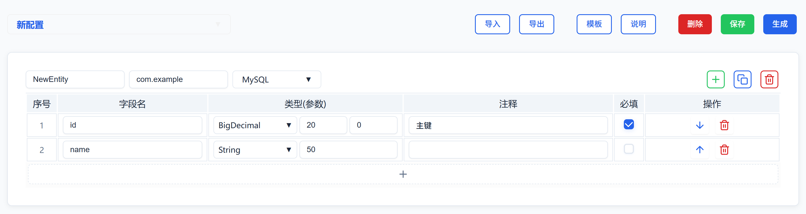

## 快捷键说明

| 快捷键           | 功能说明     |
| ---------------- | ------------ |
| **Ctrl + S**     | 保存配置     |
| **Ctrl + Enter** | 生成代码     |
| **Ctrl + I**     | 导入配置     |
| **Ctrl + E**     | 导出配置     |
| **Ctrl + T**     | 打开模板编辑 |
| **Ctrl + H**     | 打开说明     |
| **Ctrl + D**     | 删除配置     |

---

## 功能概述

代码生成器是一个基于Web的Java代码生成工具，支持快速生成Spring Boot项目的完整代码结构，包括实体类、VO类、Service接口、Service实现类、Mapper接口、Controller控制器、SQL建表语句等。支持MySQL和Oracle数据库，提供可视化的配置界面和模板编辑功能。



---

## 主要功能

- 📝 **配置管理**：支持保存、加载、删除配置
- 📤 **导入导出**：JSON格式配置导入导出
- 🎨 **模板编辑**：自定义代码生成模板
- ⚡ **代码生成**：一键生成完整项目代码
- 📋 **示例生成**：快速生成示例配置
- 🔧 **数据库支持**：MySQL和Oracle双数据库

---

## 生成的文件类型

- 🏗️ **实体类**：Domain实体类（带注解）
- 📋 **VO类**：展示对象类（带校验）
- 🔧 **Service接口**：业务接口定义
- ⚙️ **Service实现**：业务逻辑实现类
- 🗄️ **Mapper接口**：数据访问层接口
- 🌐 **Controller**：REST API控制器
- 📊 **SQL语句**：建表SQL脚本
- 📄 **JSON配置**：配置示例文件

---

## 配置格式说明

**1. 实体配置格式：**

```json
"包名.类名": {
  "databases": "mysql",
  "字段名": "类型(参数) | *注释"
}
```

**2. 字段格式说明：**

- `字段名`：Java驼峰命名，自动转换为数据库下划线命名
- `类型(参数)`：Java数据类型，括号内为参数（可选）
- `*注释`：字段注释，*号表示必填字段

---

## 支持的字段类型

- `String(length)`：字符串，默认255
- `Long(length)`：长整型，默认20
- `Integer`：整型
- `BigDecimal(precision,scale)`：高精度数值
- `LocalDateTime(pattern)`：日期时间
- `Boolean`：布尔值

**示例：**  
`String(100)`、`BigDecimal(10,2)`、`LocalDateTime(yyyy-MM-dd HH:mm:ss)`

---

## 自动处理功能

- 🆔 **通用字段**：自动添加id、createTime、updateTime等
- 🔄 **命名转换**：驼峰转下划线命名
- 📝 **注解添加**：Swagger、校验、JSON格式化
- 🔍 **字段校验**：必填、邮箱、手机号等校验
- 🗄️ **数据库映射**：自动生成数据库字段类型
- 📊 **查询条件**：自动生成查询条件方法

---

## 使用流程

**1. 新建配置：**
- 点击"示例"按钮生成示例配置
- 或手动输入JSON配置
- 使用可视化表格编辑配置

**2. 保存配置：**
- 按`Ctrl + S`或点击"保存"按钮
- 输入配置名称
- 配置将保存到本地存储

**3. 生成代码：**
- 按`Ctrl + Enter`或点击"生成"按钮
- 系统将生成完整的项目代码
- 可复制代码到项目中直接使用

---

## 高级功能

- 🎨 **模板自定义**：修改代码生成模板
- 📤 **配置导出**：导出JSON配置分享
- 📥 **配置导入**：导入他人分享的配置
- 🗑️ **配置管理**：删除不需要的配置
- 📋 **示例生成**：快速生成示例配置
- 🔧 **数据库切换**：MySQL/Oracle切换

---

## 注意事项

- 配置数据保存在浏览器本地存储中，清除浏览器数据会丢失
- 生成的代码需要根据实际项目需求进行调整
- 模板修改后需要保存配置才能生效
- 建议定期导出重要配置作为备份
- 所有快捷键在页面任何位置都有效
- 支持多配置管理，可保存多个不同的项目配置
